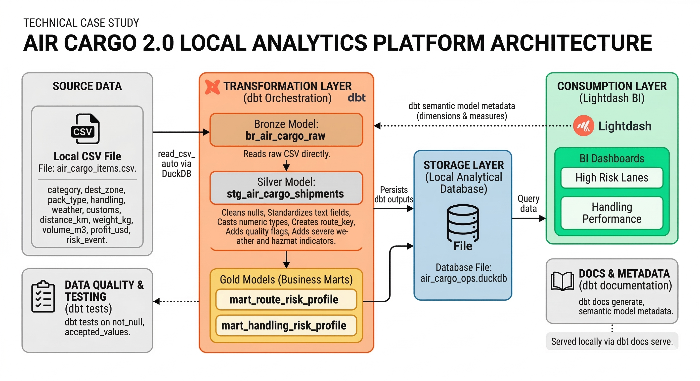

# Air Cargo 2.0: DuckDB + dbt + Lightdash

# Author: Vivek Reddy Bhimavarapu
This project uses a fully local analytics stack to build a production-style ELT workflow for air cargo risk intelligence without cloud credentials.

## Project Goal
Identify high-risk logistics lanes for operational decision-making by applying automated data cleaning and feature engineering to high-value shipment records.

## Stack
- DuckDB: local analytical database
- dbt-duckdb: SQL transformation framework and testing
- Lightdash: BI layer for stakeholder dashboards

## Medallion Design
1. Bronze (`models/bronze`): raw CSV ingestion via DuckDB `read_csv_auto`.
2. Silver (`models/silver`): cleaned and standardized shipment records with quality/disruption flags.
3. Gold (`models/gold`): business-facing risk marts for lane and handling risk monitoring.

## System Architecture
The diagram below shows how data flows through the local pipeline into Power BI outputs.



## Repository Layout
- `dbt_project.yml`: dbt project configuration and model defaults.
- `profiles/profiles.yml`: local DuckDB connection profile.
- `models/bronze/br_air_cargo_raw.sql`: raw model from CSV.
- `models/silver/stg_air_cargo_shipments.sql`: cleaning and feature staging model.
- `models/gold/mart_route_risk_profile.sql`: lane-level high-value risk scoring and tiering.
- `models/gold/mart_handling_risk_profile.sql`: handling/customs risk performance table.
- `models/schema.yml`: model tests plus Lightdash-friendly semantic metadata.
- `scripts/run_air_cargo_local.py`: one-command pipeline runner (`debug`, `run`, `test`, `docs generate`).
- `scripts/export_powerbi_data.py`: exports gold marts to CSV for Power BI.
- `lightdash/README.md`: Lightdash setup and dashboard guidance.

## Python Script Documentation
- Simple, function-by-function guide:
  - `docs/python_scripts_guide.md`

## Power BI Report Files
- Editable dashboard file: `Air_cargo_ops_visualizations.pbix`
- Shareable view/export file: `Air_cargo_ops_visualizations.pdf`

How to use:
1. Open the `.pbix` file in Power BI Desktop.
2. If prompted, point data sources to:
  - `bi_exports/mart_route_risk_profile.csv`
  - `bi_exports/mart_handling_risk_profile.csv`
3. Refresh to load the latest exported mart data.

## Setup
1. Install dependencies:

```bash
pip install -r requirements.txt
```

2. Run dbt with local profile directory:

```bash
python scripts/run_air_cargo_local.py
```

This command runs, in order:
1. `dbt debug --profiles-dir profiles`
2. `dbt run --profiles-dir profiles`
3. `dbt test --profiles-dir profiles`
4. `dbt docs generate --profiles-dir profiles`
5. Exports Power BI-ready CSV files to `bi_exports/`

To view docs locally after generation:

```bash
dbt docs serve --profiles-dir profiles
```

## Core Business Outputs
1. `gold.mart_route_risk_profile`
- Prioritized lane risk table for high-value shipment exposure.
- Includes risk score, risk tier, and route priority rank.

2. `gold.mart_handling_risk_profile`
- Risk performance by handling and customs pattern.

## Power BI (Recommended Local Flow)
If ODBC locks the DuckDB file during refresh, use exported CSVs instead:
1. Run:
  - `python scripts/run_air_cargo_local.py`
2. Import these files into Power BI:
  - `bi_exports/mart_route_risk_profile.csv`
  - `bi_exports/mart_handling_risk_profile.csv`
3. Refresh sequence:
  - Re-run pipeline script
  - In Power BI, refresh imported CSV tables

This avoids DuckDB file-handle conflicts from Power BI Mashup containers.

## Lightdash Layer
After dbt models are built:
1. Install and initialize Lightdash locally.
2. Connect Lightdash to this dbt project.
3. Build dashboard tabs:
- High Risk Lanes
- Handling Performance

See `lightdash/README.md` for exact steps.

## Notes
- Source schema currently does not include a carrier field. The gold mart uses route and handling/customs dimensions as operational proxies.
- The original notebook remains available as exploratory analysis:
  `Risk event prediction for air cargo.ipynb`
